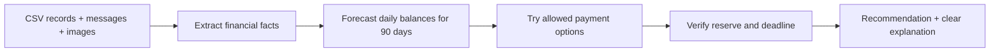

# The idea: Buy or Wait?

We are building an assistant that answers: **“Can I pay for this without missing
my bills or using the money I want to keep untouched?”**

Having enough money in the bank today is only the first check. A purchase might
leave too little for rent next week, even if another salary arrives next month.

## A simple example

Imagine you have **₹20,000**. Before the next confirmed income, you need **₹12,000**
for bills and want to keep **₹5,000** untouched.

**Safe to spend now = ₹20,000 − ₹12,000 − ₹5,000 = ₹3,000.**

For an ₹8,000 purchase, the agent checks whether you can wait, pay part now, or use
an offered installment plan. Each option must keep enough money available on
**every day**, complete before the purchase deadline, and respect your preferences.
The real calculation repeats this check across 90 days.

## What each part does



1. **Read the records.** CSV files give balances, spending history and payment offers.
2. **Read unfamiliar images with AI.** Send the image and its linked event to a
   vision API. Ask for the relevant amount, currency and visible evidence. For a
   taxi receipt, use the fare, not the cash handed to the driver.
3. **Remember the result.** Cache by image contents and financial context. A new or
   changed document is read dynamically; unchanged evidence costs no new API call.
4. **Estimate upcoming spending.** Detect repetition in the user's own history.
   Compare small forecasting windows using past transactions, with more penalty
   for underestimating a bill than overestimating it. Keep the assumptions visible.
5. **Try the payment plans.** Python calculates full payment, partial payment,
   offered installments, waiting and permitted flexible-spending changes.
6. **Explain the decision.** Show safe money today, payment dates, protected balance
   and any unresolved evidence. AI extracts facts; it does not invent an answer
   that bypasses the financial checks.

## Try it

Open **[idea.html](idea.html)** in a browser. It is a small interactive example with
fictional amounts: change the balance, bills, salary and purchase price to see why
“enough cash today” can still mean “wait”. It does not use an API key.

For a walkthrough of an actual generated dataset prediction:

```bash
python3 code/explain.py request_33
```

For a different dataset, run the main program with its dataset path and
`OPENAI_API_KEY` set in your environment. See [setup](code/README.md).

## What is still uncertain?

An image model can misread numbers, and a forecast can miss future changes. Strict
JSON validation checks the result's shape and currency; it cannot prove the image
was read correctly. Uncertain images are escalated and then rejected if unresolved.
Public-sample metrics measure the current approach; they do not establish hidden-test accuracy. No claim is made that this is the most accurate possible estimator.
